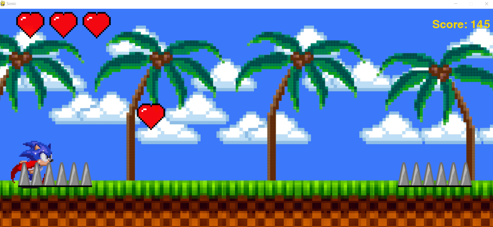

# My version of the Sonic game 😁

Press 'S' to start playing the game. You have to avoid obstacles by jumping (pressing 'SPACE') over them. Spikes, rocks, ducks and birds are the obstacles. You can catch the flying hearts, they give you more health(hearts).

# Requirements:
python 3.11 and higher

(on Windows)

1. Download zip file of the repository
2. Create a new folder and inside the folder create a virtual environment by putting `python -m venv env` in the terminal and after this activate the environment by `env/Scripts/activate`.
3. Install pygame-ce by using command: `pip install pygame-ce`
4. Put everything from zip inside the folder and call main.py

